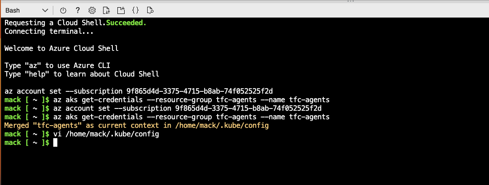
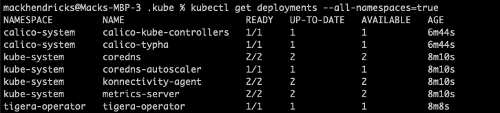
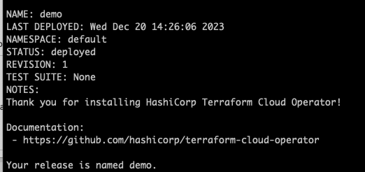
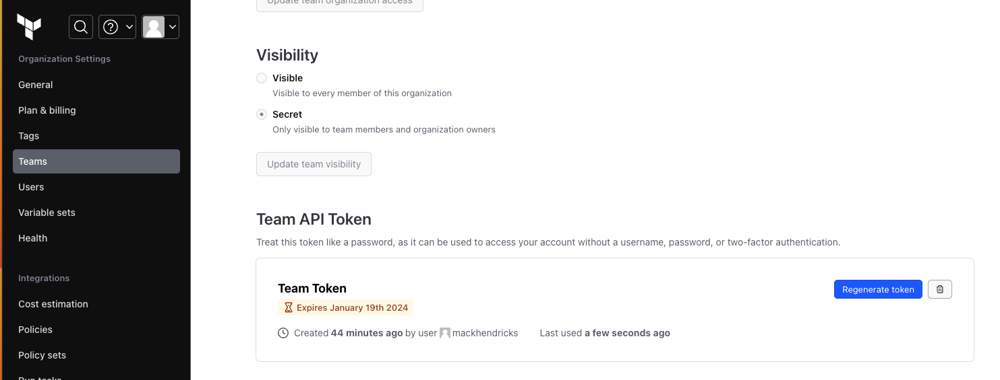

# Setting Up TFC/TFE Agent Pools Using Kubernetes

In this repo we will focus on setting up TFC/TFE Agents on Azure Kubernetes Service.  This should work on other Kubernete services as well

## Assumptions

- Running a Mac or Linux

## Prerequistes 

1. Azure Subscription
2. Kubectl command line installed on your local machine
3. Helm is installed on your local machine

## Setup Steps

1. Setup the Azure Kubernetes Service.  We used Kubernetes version 1.27.7.  
2. Click the "Connect" Button and then select Cloud Shell.  The Cloud Shell will authenticate to Azure and create a Kubernetes config file.   Click the download button to download the config file to local machine.  Copy the download file to your local ./kube/config.  This will allow you to interact with the cluster from your local machine using kubectl 



3. Perform a chmod on the new file

```
chmod 500 ~/.kube/config
```

4. Run the following command to ensure you can communicate with your Kubernetes cluster:

```
kubectl get deployments --all-namespaces=true
```



5. Setup Helm
```
helm repo add hashicorp https://helm.releases.hashicorp.com
helm repo update
helm install demo hashicorp/terraform-cloud-operator --wait --version 2.1.0
```



6. Login to TFC/TFE and create a Team Token.  Note, select the owners team



7. Create a Kubernetes secret with the Team Token

```
kubectl create secret generic tfc-operator --from-literal=token=<some token>
```

8. Create an agentpool.yaml file as shown below.  Change the organization from mack-demo to your TFC/TFE organization

```
apiVersion: app.terraform.io/v1alpha2
kind: AgentPool
metadata:
  name: this
  namespace: default
spec:
  organization: mack-demo
  token:
    secretKeyRef:
      name: tfc-operator
      key: token
  name: agent-pool-demo
  agentTokens:
    - name: white
    - name: blue
    - name: red
  agentDeployment:
    replicas: 3
    spec:
      containers:
        - name: tfc-agent
          image: "hashicorp/tfc-agent:latest"
```


9. Apply the AgentPool yaml

```
kubectl apply -f agentpool.yaml
```

10. Validate that the AgentPool was created by logging into TFC/TFE and going to the Agent Pool screen.  Alternately, run the following command:

```
kubectl describe agentpool this
```